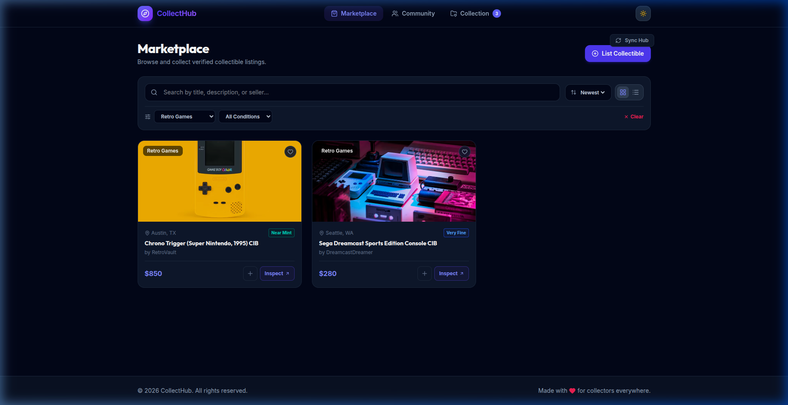
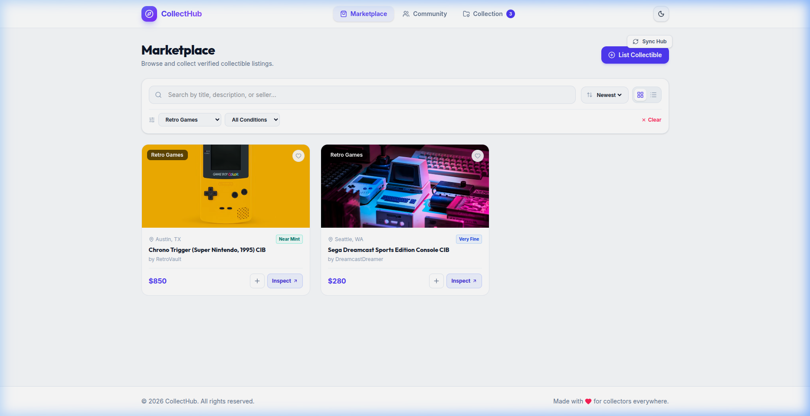
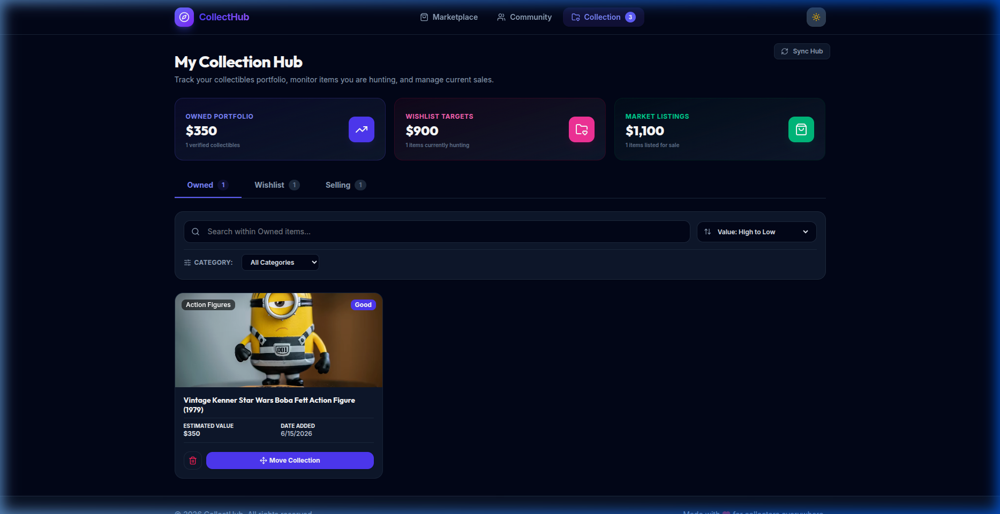
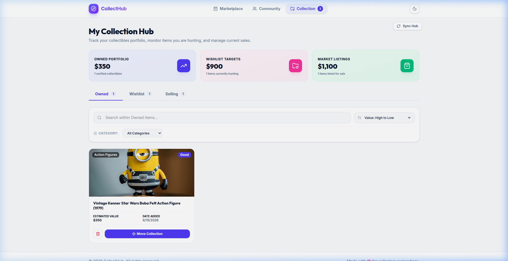
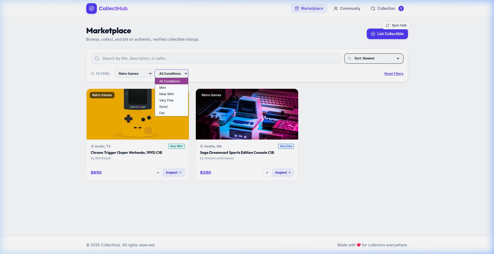
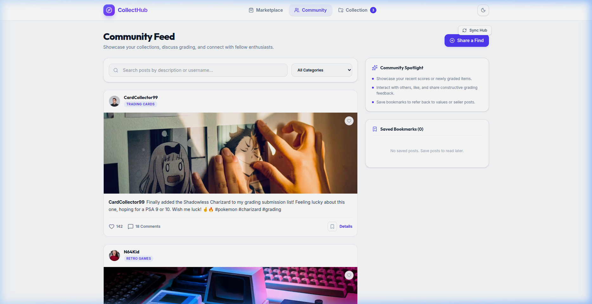

# CollectHub 🌟

CollectHub is a premium, highly responsive web application built with **React**, **TypeScript**, **Vite**, and **Tailwind CSS v4** for collectors to discover rare items, manage their portfolios, and interact with a community of fellow hobbyists.

---

## 📸 Screenshots

Here are previews of the user interface in both **Dark Mode** and **Light Mode**:

### 1. Marketplace Module

|                         Dark Mode                         |                            Light Mode                            |
| :-------------------------------------------------------: | :--------------------------------------------------------------: |
|  |  |

### 2. My Collection Portfolio Dashboard

|                        Dark Mode                        |                           Light Mode                           |
| :-----------------------------------------------------: | :------------------------------------------------------------: |
|  |  |

### 3. Community Feed & Discussion Spotlight

|                       Dark Mode                       |                          Light Mode                          |
| :---------------------------------------------------: | :----------------------------------------------------------: |
|  |  |

---

## ✨ Features Checklist

### 1. Marketplace

- **Explore Listings**: View collectible items complete with pricing, seller names, item condition, locations, and high-quality images.
- **Advanced Filtering**: Live filter listings by search queries, categories, and item conditions.
- **Flexible Sorting**: Sort items by date added (newest/oldest) or price (low to high/high to low).
- **Interactive Details**: Click any listing to open a detailed modal overlay displaying full descriptions and seller details.
- **Collection Quick-Add**: Add items directly to your personal portfolio (Owned, Wishlist, or Selling list) right from the item modal.

### 2. My Collection

- **Tabbed Dashboard**: View your collection categorized into **Owned**, **Wishlist**, and **Selling** tabs.
- **Portfolio Valuation**: Real-time aggregation of total estimated value and item counts for each category.
- **Relocation (Move States)**: Easily move items between tabs (e.g., from Wishlist to Owned, or Owned to Selling) with an inline action popup.
- **Search & Filters**: Search within specific tabs and filter items by category.

### 3. Community Feed

- **Hobbyist Posts**: View a feed of community acquisitions, complete with likes, bookmarks, and category tags.
- **Share Acquisitions**: Create and publish community posts with images, category selection, and descriptions.
- **Interactive Modals**: Check post details and read a live, scrollable comments feed.
- **Spotlight Sidebar**: A quick-actions section detailing guidelines, user stats, and your list of saved bookmarks.

### 4. Advanced UX Polish

- **Blocking Theme Selector**: Persistent theme selector (Light/Dark mode) with a custom blocking script in `<head>` to prevent flash-of-light-mode (FOUC) on slow reloads.
- **Debounced Filters**: Efficient input search utilizing a custom `useDebounce` hook (350ms delay) to prevent redundant DOM updates.
- **Skeleton Shimmers**: Smooth, custom animated skeleton loaders for all listings, card grids, and list items.
- **Image Lazy Loading**: Custom component using the `IntersectionObserver` API to load high-resolution images asynchronously as they enter the viewport.
- **Feedback Toasts**: Toast messages displaying success/error events (e.g., "Added to favorites", "Moved to wishlist").

---

## 🛠️ Project Setup

### Prerequisites

Make sure you have Node.js (version 18 or above) installed on your machine.

### Installation Steps

1. **Clone the repository**:

   ```bash
   git clone https://github.com/dipaldas8888/collecthub.git
   cd collecthub
   ```

2. **Install all dependencies**:

   ```bash
   npm install
   ```

3. **Start the local development server**:

   ```bash
   npm run dev
   ```

   Open your browser to `http://localhost:5173/` (or the URL provided in the console).

4. **Build the production bundle**:
   ```bash
   npm run build
   ```
   This will run Typechecks (`tsc -b`) and build optimized production files inside the `dist/` directory.

---

## 🏗️ Architecture & Component Design

The project follows a clean, module-based folder structure:

```
├── index.html              # HTML shell containing the blocking dark-mode script
├── package.json
├── src
│   ├── main.tsx            # App mount point
│   ├── App.tsx             # Root element containing Router and Layout
│   ├── index.css           # Tailwind CSS imports and custom animations
│   ├── components
│   │   ├── Layout.tsx      # Main application structure, footer & content area
│   │   ├── Navbar.tsx      # Navigation links and dark-mode switcher
│   │   ├── DetailModal.tsx # Reusable modal for listings & posts
│   │   ├── LazyImage.tsx   # Observer-based lazy image component
│   │   ├── FavoriteButton.tsx
│   │   ├── Skeletons.tsx   # Shimmer skeletons for grids, lists, and posts
│   │   └── ViewToggle.tsx  # Grid/List switcher for Marketplace
│   ├── context
│   │   └── AppContext.tsx  # Single-source-of-truth state container
│   ├── hooks
│   │   ├── useDebounce.ts  # Input debounce utility
│   │   ├── useFavorites.ts # Favorites persistent handler
│   │   └── useTheme.ts     # Dark-mode context access wrapper
│   └── pages
│       ├── Marketplace.tsx # Listing filters, grid view, list view
│       ├── Collection.tsx  # Tabbed portfolio with value calculators
│       └── Community.tsx   # Feed posts list, bookmarks sidebar, create post form
```

### State Management Strategy

- **AppContext**: Serves as the global database containing lists of products, community posts, favorites, active toast messages, and dark-mode preferences. It synchronizes automatically with `localStorage` to persist modifications across reloads.
- **Controlled Inputs & Debounce**: Local text fields drive input states instantly for typing responsiveness, while calculations use a debounced search term to avoid redundant re-renders.

---

## 🎨 Styles & Transitions

- Handled with **Tailwind CSS v4**.
- Uses custom variables and variants inside `index.css` for consistent dark mode styles.
- Smooth transitions for page changes, hover states, and sidebar toggling.
